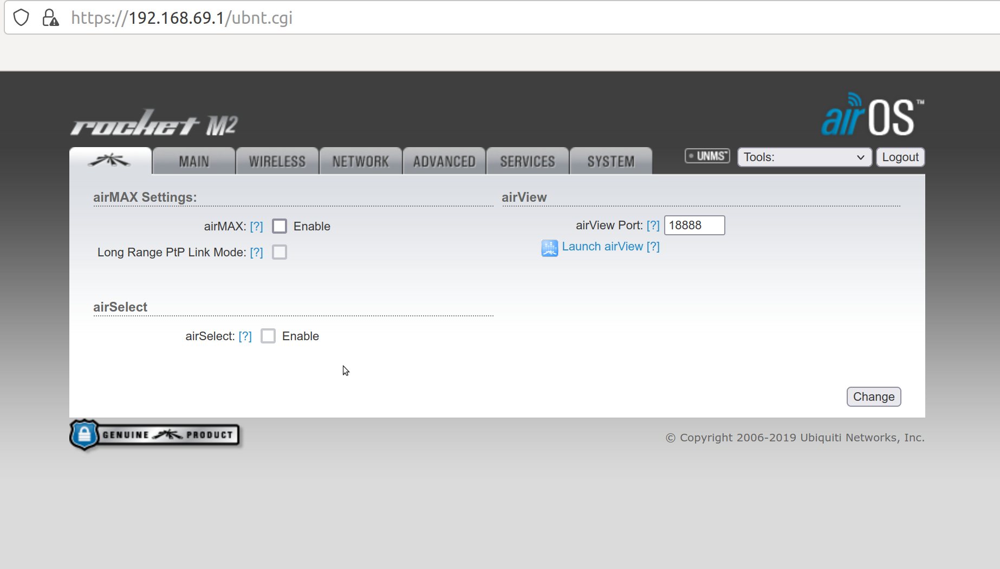
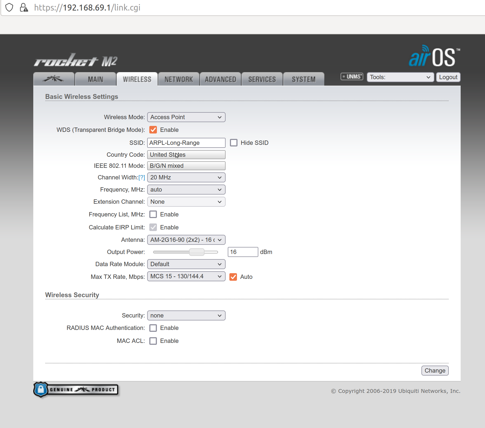
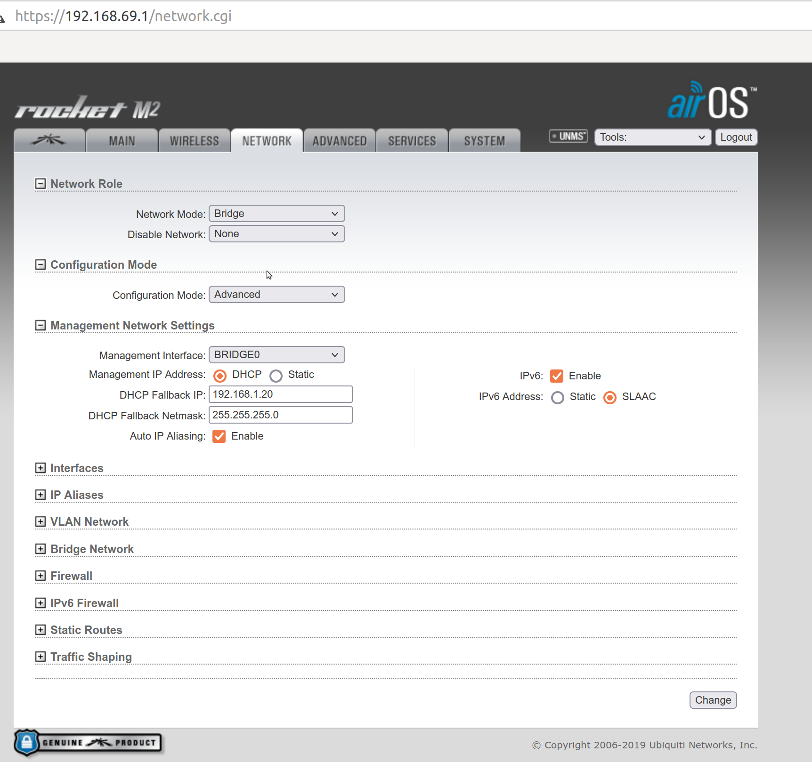

# ARPL-Long-Range-Antenna
How to setup a stable communication between your laptop and an external device through the Arpl long range antenna.
In this reporsitory is described how to connect your laptop, through wired connection, and an external device (drone or robot) to the ARPL-Long-Range Antenna. 

This repository is valid with the Antenna Ubiquiti AM Ubiquiti AM-2G 16-90 and the device Ubiquiti Rocket M2. 
**Tools Required:**
 - Antenna Ubiquiti AM-2G 16-90 (Fig. 1) 
 - Rocket M2 (Fig. 2).
 - Switch  LAN-POE (Fig. 3).
 
  
 Fig. 1: Antenna Ubiquiti AM-2G 16-90
 
 
  
 Fig. 2: Rocket M2
 
 
  
 Fig. 3: Switch LAN-POE
 
 
**How To Setup the Antenna:**
- Take the Switch and attach one side to the wall power outlet. 
- Connect the swith to the Antenna with an ethernet cable through the POE port.
- Connect the LAN port to your laptop also using another Ethernet cable. 
- On your computer open a new page in your browser. 
- Access to the Network Management setup page (called airOS) typing 'https://192.168.69.1
- In the next page click Advance and Accept Risk. 
- The login page will appear. Type login 'ubnt' and password 'arpllab11'. (Same password is valid for ARPL-GameLab Network at the address 128.238.47.10. To connect to ARPL-GameLab the password is 1234567890)
- Click on the Ubiquiti logo tab at the top left corner of the setup window page to visualize the AirMax setup page as in Fig. 4. 

  
 Fig. 4: Airmax tab. 
 
 
- In the Ubiquiti logo tab check that **<br /> AIRMax <br />** is disabled. 
- Check in the Wireless Tab that the first option Wireless Mode is configured as 'Access Point'. 
- Check that Channel Width is 20 MHz.
- Check that Frequency is 'Auto'.
- Check Antenna is the corresponding model.
- Make a double check looking at Figure 5 to see if your age is exactly the same of the one in the figure.
  
  
 Fig. 5: Wireless tab. 

- In the Network Tab, check that the setting Network Mode is defined on Bridge. 
- The Network Tab page should be appear as in Fig. 6. 

  
 Fig. 6: Network tab.


**On Your Laptop:**

 - Download this repository typing in a shell the following command. 
 ```txt
 git clone https://github.com/arplaboratory/ARPL-Long-Range-Antenna.git
 ```
 - Type ifconfig to verify the name of your ethernet connection. Don't worry if the ip address is not assigned. It will be assigned in the next steps.
 
- Install docker if it is not alredy present in your laptop.
- Go inside dhcp folder, open the file 'run_dhcp_docker.bash'.
- Change 'enx000ec6cac946' with the name of your wired connection as it ppears in ifconfig.
- Change if you want the last numbers XX (default are 69) of the ip address in the second line with a number between 3 and 254 (for example 192.168.69.200).
- Before running the bash script check that the wired connection in your pc is turned off.
- To make the script run_dhcp_docker.bash executable and to run it, type the commands:
 ```txt
  cd dhcp
  
  chmod +x run_dhcp_docker.bash

  ./run_dhcp_docker.bash
  ```
 
 When the script is running, your computer is acting as a virtual router, making possible to use the Rocket M2 in Bridge Mode. 
 
**On the external device:**
- Go to Wifi Settings and connect the pc to ARPL-Long-Range Wifi signal. 
- Check the Ip assigned to the device with ifconfig. 
- Try to ping the laptop to see if the communication is enabled. 

As a final step configure the laptop ROS_MASTER_URI with the ip address of the external device. This permits to run the roscore on the external device and to have all the topic lists in your pc. 
- Navigate to hosts folder:
```txt
cd /etc
vim hosts
```
- Modify the file inserting a new row with the ip address of your device and the name of the device {name_device}.
- Go to .bashrc file. 
- Add 
```txt
ROS_MASTER_URI:=https://{name_device}:11201
```
 

